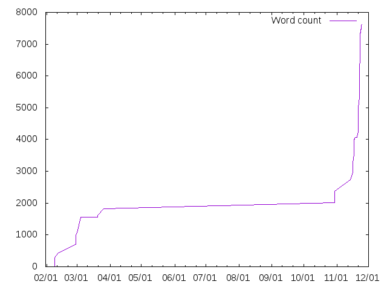

# Plot texcount
Plots the number of words for every commit for a latex document tracked with git. 

## Example run
Run it in the root of your git repository with

    plot_texcount.sh master "*.tex"

and similar for any other branch than master.

## Example output

